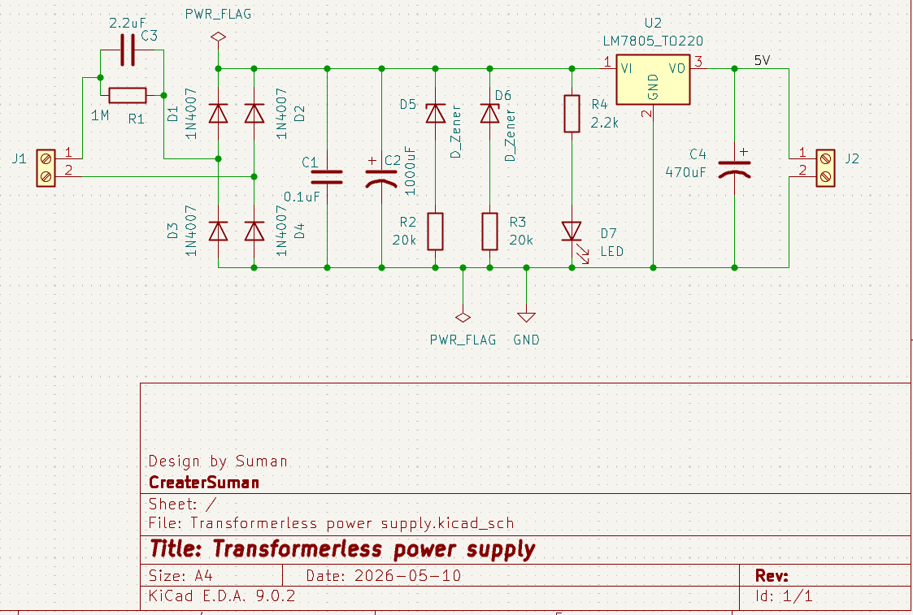

# 🔌 Transformerless Power Supply PCB Design

A compact **Transformerless Power Supply Circuit** designed using **KiCad EDA 9.0.2** that converts AC mains voltage into regulated **5V DC output** without using a transformer.

---

## 📌 Project Overview

This project demonstrates the design of a low-cost transformerless power supply using:

- Capacitive voltage dropping
- Bridge rectification
- Filtering capacitors
- Zener protection
- LM7805 voltage regulation

The circuit is designed for low-power electronic applications where compact size and low component cost are important.

---

## 🖼 Project Schematic

> Add your schematic image here

```md

```

---

## ⚙ Features

- AC to DC conversion
- 5V regulated DC output
- Compact PCB design
- Low component count
- LED power indication
- Overvoltage protection using Zener diode

---

## 🛠 Software Used

| Tool | Version |
|------|---------|
| KiCad EDA | 9.0.2 |

---

## 🔩 Components Used

| Component | Value / Part |
|-----------|--------------|
| U1 | LM7805 Voltage Regulator |
| D1–D4 | 1N4007 Rectifier Diodes |
| D5–D6 | Zener Diodes |
| D7 | LED |
| C1 | 0.1µF Capacitor |
| C2 | 100µF Capacitor |
| C3 | 2.2µF Capacitor |
| C4 | 470µF Capacitor |
| R1 | 1MΩ Resistor |
| R2, R3 | 20KΩ Resistors |
| R4 | 2.2KΩ Resistor |

---

## 🔍 Working Principle

### 1. Capacitive Voltage Dropping
The AC mains voltage is reduced using a non-polarized capacitor instead of a bulky transformer.

### 2. Rectification
Diodes D1–D4 form a bridge rectifier that converts AC voltage into pulsating DC.

### 3. Filtering
Capacitors smooth the rectified DC signal and reduce ripple voltage.

### 4. Voltage Regulation
The LM7805 regulator provides stable 5V DC output.

### 5. Protection
Zener diodes help protect the circuit from voltage spikes and overvoltage conditions.

---

## 📐 PCB Design Highlights

- Designed in KiCad EDA
- Compact component placement
- Easy routing structure
- Beginner-friendly PCB layout
- Suitable for low-power embedded applications

---

## ⚠ Safety Warning

> This project directly interfaces with AC mains voltage.

### Important Safety Notes:
- Do NOT touch the circuit while powered.
- Use proper insulation.
- Test carefully using safety precautions.
- Recommended for educational purposes only.
- Isolation transformer is recommended during testing.

---

## 🎯 Learning Outcomes

Through this project, I learned:

- Transformerless power supply design
- AC to DC rectification
- Voltage regulation using LM7805
- PCB schematic creation in KiCad
- Power electronics fundamentals
- Importance of electrical safety

---

## 🚀 Future Improvements

- Add fuse protection
- Add MOV surge protection
- Improve PCB isolation spacing
- Add output filtering enhancements
- Design compact single-layer PCB

---

## 📂 Project Structure

```bash
Transformerless-Power-Supply/
│
├── Schematic/
├── PCB_Layout/
├── Gerber_Files/
├── Images/
├── BOM/
└── README.md
```

---

## 📸 Recommended Images for Repository

Add these images inside the `images/` folder:

- Schematic Screenshot
- PCB Layout
- 3D PCB View
- Fabricated PCB
- Testing Setup

---

## 🧠 Skills Demonstrated

- PCB Design
- Power Electronics
- KiCad EDA
- Circuit Design
- Hardware Development
- Electronic Prototyping

---

## 👨‍💻 Author

**Suman**  
Electronics & PCB Design Enthusiast

---

## 📜 License

This project is open-source and available for learning and educational purposes.
